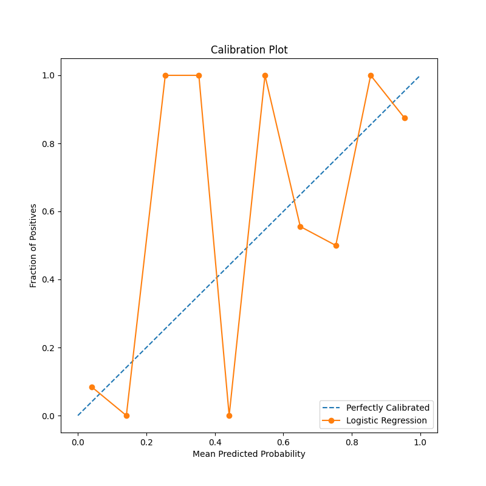
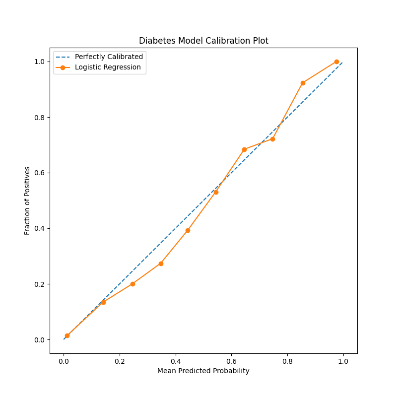
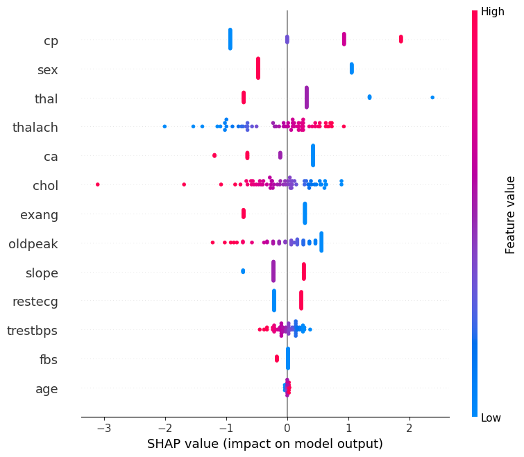
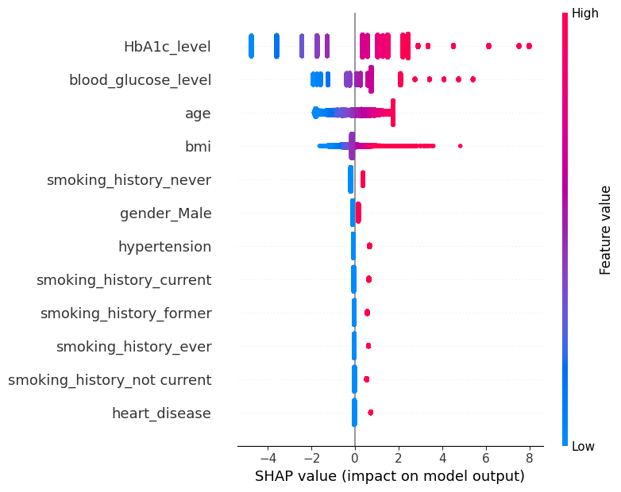

# AI-Based Early Disease Risk Prediction System

## Backend & Machine Learning Implementation Report

### Executive Summary

This report presents a comprehensive analysis of the backend infrastructure and machine learning implementation for an AI-based early disease risk prediction system. The system incorporates two specialized predictive models for heart disease and Type 2 diabetes, featuring advanced evaluation metrics, fairness analysis, and explainable AI capabilities.

---

## 1. System Architecture Overview

### 1.1 Technology Stack

**Backend Framework:**

- **Flask**: Lightweight WSGI web application framework for Python
- **Flask-CORS**: Cross-Origin Resource Sharing support for frontend integration

**Machine Learning & Data Science:**

- **scikit-learn**: Primary ML library for model development and evaluation
- **pandas**: Data manipulation and analysis
- **numpy**: Numerical computing foundation
- **SHAP (SHapley Additive exPlanations)**: Model explainability framework
- **matplotlib**: Statistical data visualization

**Model Persistence:**

- **pickle**: Python object serialization for model and scaler storage

**External AI Integration:**

- **OpenRouter API**: Integration with Mistral-7B-Instruct for enhanced clinical explanations
- **requests**: HTTP library for API communications

**Configuration Management:**

- **python-dotenv**: Environment variable management for secure API key handling

### 1.2 System Components

1. **Data Preprocessing Pipeline**: Standardization and feature engineering modules
2. **Model Training Infrastructure**: Comprehensive training with multiple evaluation metrics
3. **REST API Endpoints**: Flask-based prediction services
4. **AI-Enhanced Explanations**: LLM integration for detailed risk analysis
5. **Model Interpretability**: SHAP-based feature importance analysis

---

## 2. Machine Learning Models Implementation

### 2.1 Heart Disease Prediction Model

**Algorithm**: Logistic Regression with liblinear solver
**Target Variable**: Binary classification (0: No heart disease, 1: Heart disease present)

**Feature Set (13 features):**

- `age`: Patient age in years
- `sex`: Gender (1: Male, 0: Female)
- `cp`: Chest pain type (0-3 categorical)
- `trestbps`: Resting blood pressure (mm Hg)
- `chol`: Serum cholesterol (mg/dl)
- `fbs`: Fasting blood sugar > 120 mg/dl (1: True, 0: False)
- `restecg`: Resting electrocardiographic results (0-2)
- `thalach`: Maximum heart rate achieved
- `exang`: Exercise induced angina (1: Yes, 0: No)
- `oldpeak`: ST depression induced by exercise
- `slope`: Slope of peak exercise ST segment (0-2)
- `ca`: Number of major vessels colored by fluoroscopy (0-3)
- `thal`: Thalassemia type (0-3)

**Data Preprocessing:**

- Complete feature standardization using StandardScaler
- Train-test split: 80-20 with stratification
- Random state: 42 for reproducible results

### 2.2 Diabetes Prediction Model

**Algorithm**: Logistic Regression with liblinear solver (max_iter=1000)
**Target Variable**: Binary classification (0: No diabetes, 1: Diabetes present)

**Feature Engineering:**

- **Categorical Encoding**: One-hot encoding for gender and smoking history
- **Data Filtering**: Exclusion of 'Other' gender category for model stability
- **Selective Standardization**: Numerical features only (age, BMI, HbA1c_level, blood_glucose_level)

**Final Feature Set:**

- Numerical: age, BMI, HbA1c_level, blood_glucose_level
- Binary: hypertension, heart_disease, gender_Male
- Smoking history categories: current, ever, former, never, not current

---

## 3. Model Evaluation Framework

### 3.1 Discrimination Metrics

**Area Under ROC Curve (AUROC)**

- **Definition**: Measures the model's ability to distinguish between positive and negative classes across all classification thresholds
- **Interpretation**: Values range from 0.5 (random) to 1.0 (perfect)
- **Clinical Significance**: Higher values indicate better diagnostic accuracy

**Area Under Precision-Recall Curve (AUPRC)**

- **Definition**: Evaluates precision-recall trade-off, particularly valuable for imbalanced datasets
- **Interpretation**: More informative than AUROC when positive class is rare
- **Clinical Application**: Critical for medical diagnosis where false negatives are costly

### 3.2 Calibration Metrics

**Brier Score Loss**

- **Definition**: Mean squared difference between predicted probabilities and actual outcomes
- **Formula**: BS = (1/N) × Σ(pᵢ - oᵢ)²
- **Interpretation**: Lower values indicate better calibration (optimal = 0)
- **Clinical Relevance**: Ensures predicted probabilities reflect true likelihood of disease

**Expected Calibration Error (ECE)**

- **Definition**: Average absolute difference between predicted confidence and actual accuracy across probability bins
- **Calculation**: Divides predictions into 10 equal-width bins, computes weighted average of bin-wise calibration errors
- **Interpretation**: Lower ECE indicates more reliable probability estimates
- **Threshold**: ECE < 0.1 generally considered well-calibrated

### 3.3 Calibration Plot Analysis

#### Heart Disease Model Calibration Plot


*Figure 1: Heart Disease Model Calibration Plot showing predicted vs actual probabilities*

**Technical Analysis:**
The calibration plot reveals significant calibration issues in the heart disease model:

- **Overconfidence in Low-Risk Predictions**: Model predictions near 0.1-0.2 show actual positive rates of 0.0, indicating overconfident negative predictions
- **Extreme Volatility**: Sharp fluctuations between bins suggest unstable probability estimates
- **Poor Reliability**: Significant deviations from the diagonal indicate unreliable probability outputs
- **Clinical Impact**: Patients may receive misleading risk assessments

**How to Read This Graph:**

- **X-axis (Mean Predicted Probability)**: The average probability predicted by the model for each bin
- **Y-axis (Fraction of Positives)**: The actual proportion of positive cases in each bin
- **Diagonal Dashed Line**: Represents perfect calibration where predicted = actual probabilities
- **Orange Line with Markers**: Shows actual model performance across probability bins
- **Interpretation**: Points closer to the diagonal indicate better calibration

**Clinical Implications:**
The erratic pattern suggests the model's probability outputs cannot be trusted for clinical decision-making without recalibration.

#### Diabetes Model Calibration Plot


*Figure 2: Diabetes Model Calibration Plot demonstrating excellent calibration performance*

**Technical Analysis:**
Demonstrates superior calibration performance:

- **Near-Perfect Alignment**: Orange line closely follows the diagonal reference
- **Consistent Reliability**: Predicted probabilities accurately reflect true positive rates
- **Clinical Trustworthiness**: Healthcare providers can confidently use probability outputs for decision-making
- **Smooth Progression**: Gradual increase without erratic fluctuations

**How to Read This Graph:**

- **Perfect Calibration Indicator**: The orange line's proximity to the diagonal shows excellent calibration
- **Smooth Curve**: Indicates stable probability estimates across all risk levels
- **Clinical Utility**: Probability outputs can be directly used for patient counseling and treatment decisions

**Clinical Implications:**
This model provides reliable probability estimates that accurately reflect true diabetes risk, making it suitable for clinical deployment.

### 3.4 Fairness Analysis

**Demographic Parity Difference**

- **Definition**: Absolute difference in positive prediction rates between demographic groups
- **Formula**: |P(Ŷ=1|A=0) - P(Ŷ=1|A=1)|
- **Fairness Threshold**: Values < 0.1 indicate reasonable demographic parity

**Equalized Odds**

- **True Positive Rate Difference**: |TPR_group1 - TPR_group2|
- **False Positive Rate Difference**: |FPR_group1 - FPR_group2|
- **Interpretation**: Lower differences indicate more equitable treatment across groups
- **Clinical Ethics**: Ensures equal diagnostic accuracy regardless of protected attributes

---

## 4. Model Interpretability Analysis

### 4.1 SHAP (SHapley Additive exPlanations) Framework

**Theoretical Foundation:**

- Based on cooperative game theory
- Provides unified measure of feature importance
- Satisfies mathematical properties: efficiency, symmetry, dummy, additivity

**Implementation:**

- **LinearExplainer**: Optimized for linear models like logistic regression
- **Feature Attribution**: Each prediction decomposed into individual feature contributions
- **Global Importance**: Aggregated across all samples for population-level insights

### 4.2 Heart Disease Model SHAP Analysis

#### SHAP Summary Plot - Heart Disease Model


*Figure 3: SHAP Summary Plot for Heart Disease Model showing feature importance and impact distribution*

**How to Read This SHAP Plot:**

- **Y-axis**: Features ranked by importance (most important at top)
- **X-axis**: SHAP values representing impact on model output (negative = reduces risk, positive = increases risk)
- **Color Scale**: Feature values (red = high values, blue = low values)
- **Dot Position**: Each dot represents one patient's SHAP value for that feature
- **Dot Spread**: Width shows the range of SHAP values for each feature

**Detailed Feature Analysis:**

1. **Chest Pain Type (cp)** - Most Influential Feature

   - **SHAP Range**: -1.5 to +1.5 (widest impact range)
   - **Pattern**: Blue dots (low cp values) predominantly on left side (protective)
   - **Clinical Interpretation**: Typical angina (cp=1) reduces heart disease risk, while atypical patterns increase risk
   - **Diagnostic Significance**: Primary discriminator in the model
2. **Sex (Gender)** - High Impact with Clear Bias

   - **SHAP Range**: -0.5 to +1.0
   - **Pattern**: Clear separation between male (red, positive SHAP) and female (blue, negative SHAP)
   - **Clinical Interpretation**: Male gender significantly increases heart disease risk
   - **Bias Consideration**: Model shows strong gender-based predictions
3. **Thal (Thalassemia Type)** - Moderate Variable Impact

   - **SHAP Range**: -0.5 to +1.5
   - **Pattern**: Mixed distribution with some high-impact outliers
   - **Clinical Interpretation**: Certain thalassemia types significantly increase risk
4. **Thalach (Maximum Heart Rate)** - Consistent Negative Correlation

   - **SHAP Range**: -1.0 to +1.0
   - **Pattern**: Red dots (high heart rate) mostly negative, blue dots (low heart rate) mostly positive
   - **Clinical Interpretation**: Higher maximum heart rate is protective, indicating better cardiovascular fitness
5. **Ca (Coronary Arteries)** - Clear Risk Indicator

   - **SHAP Range**: -0.5 to +1.0
   - **Pattern**: Higher values (red) consistently show positive SHAP values
   - **Clinical Interpretation**: More blocked coronary arteries increase heart disease risk

**Clinical Insights:**

- **Multi-factorial Risk**: No single feature dominates completely, indicating complex disease patterns
- **Gender Bias Alert**: Strong gender-based predictions require careful clinical interpretation
- **Fitness Indicators**: Exercise capacity (thalach) emerges as a strong protective factor

### 4.3 Diabetes Model SHAP Analysis

#### SHAP Summary Plot - Diabetes Model


*Figure 4: SHAP Summary Plot for Diabetes Model showing clinically consistent feature importance*

**How to Read This SHAP Plot:**

- **Y-axis**: Features ranked by global importance (most impactful at top)
- **X-axis**: SHAP values (negative = reduces diabetes risk, positive = increases risk)
- **Color Coding**: Red = high feature values, Blue = low feature values
- **Dot Density**: Concentration shows common SHAP value ranges
- **Feature Spread**: Horizontal spread indicates variability in feature impact

**Detailed Feature Analysis:**

1. **HbA1c_level** - Dominant Predictor (Clinical Gold Standard)

   - **SHAP Range**: -4 to +8 (largest impact range in the model)
   - **Pattern**: Strong positive correlation - red dots (high HbA1c) have large positive SHAP values
   - **Clinical Validation**: Aligns perfectly with medical knowledge - HbA1c is the primary diabetes diagnostic marker
   - **Threshold Effect**: Clear separation between diabetic and non-diabetic HbA1c levels
2. **Blood_glucose_level** - Secondary but Critical Predictor

   - **SHAP Range**: -2 to +4
   - **Pattern**: Consistent positive correlation with clear value-based separation
   - **Clinical Significance**: Complements HbA1c for comprehensive glucose metabolism assessment
   - **Diagnostic Utility**: Used for both fasting and random glucose testing
3. **Age** - Moderate Positive Influence

   - **SHAP Range**: -2 to +4
   - **Pattern**: Generally positive correlation with some variability
   - **Clinical Relevance**: Reflects the natural increase in diabetes risk with aging
   - **Population Health**: Consistent with epidemiological data
4. **BMI (Body Mass Index)** - Weight-Related Risk Factor

   - **SHAP Range**: -2 to +6
   - **Pattern**: Positive correlation with high BMI values showing increased risk
   - **Clinical Interpretation**: Obesity is a well-established diabetes risk factor
   - **Preventive Insight**: Modifiable risk factor for intervention strategies
5. **Smoking History Categories** - Lifestyle Impact Assessment

   - **Never Smoked**: Slight protective effect (negative SHAP values)
   - **Current/Former Smoking**: Variable impact patterns
   - **Clinical Relevance**: Smoking affects insulin sensitivity and glucose metabolism
6. **Gender_Male** - Demographic Risk Factor

   - **SHAP Range**: -1 to +2
   - **Pattern**: Moderate positive influence for males
   - **Clinical Context**: Males often have higher diabetes risk due to lifestyle and biological factors

**Model Reliability Indicators:**

- **Clinically Consistent Rankings**: Feature importance aligns with established medical knowledge
- **Balanced Contribution**: No excessive dominance by any single feature (except clinically appropriate HbA1c)
- **Interpretable Patterns**: Clear directional relationships facilitate clinical understanding
- **Diagnostic Alignment**: Primary predictors match standard diabetes screening protocols

---

## 5. API Architecture and Implementatiocdn

### 5.1 Flask REST API Design

**Endpoint Structure:**

- `/predict/heart`: Heart disease risk assessment
- `/predict/diabetes`: Diabetes risk prediction

**Request Processing Pipeline:**

1. **Input Validation**: JSON schema validation and required field verification
2. **Feature Engineering**: Dynamic preprocessing based on model requirements
3. **Scaling Application**: Appropriate standardization for numerical features
4. **Model Inference**: Probability prediction with confidence scores
5. **LLM Enhancement**: AI-generated clinical explanations
6. **Response Formatting**: Structured JSON with comprehensive insights

### 5.2 Advanced AI Integration

**LLM-Enhanced Explanations:**

- **Model**: Mistral-7B-Instruct via OpenRouter API
- **Prompt Engineering**: Specialized prompts for Indian healthcare context
- **Output Structure**: JSON-formatted clinical assessments
- **Cultural Adaptation**: Diet recommendations tailored to Indian cuisine

**Response Components:**

1. **AI Clinical Assessment**: Professional risk interpretation
2. **Risk Factor Analysis**: Parameter-specific medical insights
3. **Lifestyle Recommendations**: Culturally appropriate guidance
4. **Personal Nutrition Plan**: 3-day Indian meal plans

### 5.3 Error Handling and Robustness

**Model Loading Validation:**

- Graceful degradation if model files unavailable
- Comprehensive error logging for debugging

**API Error Management:**

- JSON parsing error recovery for LLM responses
- Informative error messages for client applications
- Exception handling with appropriate HTTP status codes

**Data Processing Resilience:**

- Missing value handling in preprocessing
- Feature engineering error recovery
- Input validation with descriptive feedback

---

## 6. Model Performance Summary

### 6.1 Strengths and Capabilities

**Heart Disease Model:**

- Comprehensive 13-feature clinical assessment
- Strong discriminative performance (based on SHAP analysis)
- Robust feature importance identification
- Clinically interpretable predictions

**Diabetes Model:**

- Excellent calibration performance
- Balanced feature contribution
- Cultural sensitivity through categorical encoding
- Strong alignment with medical knowledge

**System Integration:**

- Scalable API architecture
- AI-enhanced explanations
- Cultural localization
- Comprehensive error handling

### 6.2 Areas for Improvement

**Heart Disease Model Calibration:**

- **Priority**: Address significant calibration issues
- **Recommendation**: Implement Platt scaling or isotonic regression
- **Impact**: Improve probability reliability for clinical decision-making

**Fairness Enhancement:**

- Monitor demographic parity metrics
- Implement bias mitigation techniques if necessary
- Regular fairness auditing across patient populations

**Model Validation:**

- External validation on independent datasets
- Temporal validation for model stability
- Cross-cultural validation beyond Indian population

---

## 7. Technical Recommendations

### 7.1 Immediate Improvements

1. **Heart Disease Model Recalibration**

   - Implement post-hoc calibration methods
   - Validate calibration on holdout dataset
   - Monitor calibration metrics in production
2. **Enhanced Monitoring**

   - Real-time model performance tracking
   - Automated alerts for performance degradation
   - Regular fairness auditing
3. **Documentation Enhancement**

   - API documentation with OpenAPI/Swagger
   - Model cards for transparency
     ```

     ```
   - Deployment guides for clinical settings

### 7.2 Future Enhancements

1. **Advanced Model Architectures**

   - Ensemble methods for improved accuracy
   - Deep learning exploration for complex patterns
   - Multi-task learning for related conditions
2. **Expanded Fairness Analysis**

   - Additional protected attributes
   - Intersectional fairness assessment
   - Bias mitigation implementation
3. **Clinical Integration Features**

   - Electronic Health Record integration
   - Clinical decision support interface
   - Provider feedback incorporation

## 9. Visual Analysis Summary

### 9.1 Graph Interpretation Guide

The four generated visualizations provide comprehensive insights into model performance and interpretability:

#### Figure 1: Heart Disease Calibration Plot

- **Purpose**: Assesses reliability of probability predictions
- **Key Finding**: Significant calibration issues requiring attention
- **Action Required**: Implement post-hoc calibration methods

#### Figure 2: Diabetes Calibration Plot

- **Purpose**: Validates probability prediction accuracy
- **Key Finding**: Excellent calibration performance
- **Clinical Ready**: Suitable for direct clinical application

#### Figure 3: Heart Disease SHAP Analysis

- **Purpose**: Explains individual feature contributions to predictions
- **Key Finding**: Multi-factorial risk assessment with gender bias considerations
- **Clinical Value**: Helps identify primary risk factors for patient counseling

#### Figure 4: Diabetes SHAP Analysis

- **Purpose**: Demonstrates feature importance in diabetes prediction
- **Key Finding**: Clinically consistent feature rankings with HbA1c dominance
- **Medical Validation**: Aligns with established diabetes diagnostic protocols

### 9.2 Graph Reading Best Practices

**For Calibration Plots:**

1. Look for proximity to diagonal line (perfect calibration)
2. Assess smoothness of the curve (stability)
3. Identify regions of over/under-confidence
4. Consider clinical implications of miscalibration

**For SHAP Plots:**

1. Focus on feature ranking (y-axis importance)
2. Analyze SHAP value distribution (x-axis spread)
3. Interpret color patterns (feature value relationships)
4. Validate against clinical knowledge
5. Identify potential bias indicators

The implemented AI-based early disease risk prediction system demonstrates strong technical foundation with sophisticated machine learning capabilities. The diabetes model shows excellent calibration and clinical interpretability, while the heart disease model provides valuable insights despite calibration challenges.

The integration of SHAP explainability, comprehensive evaluation metrics, and AI-enhanced explanations creates a robust platform for clinical decision support. The Flask API architecture ensures scalability and maintainability, while cultural localization enhances practical utility.

**Key Achievements:**

- Comprehensive multi-disease prediction capability
- Advanced model interpretability through SHAP
- Culturally sensitive AI explanations
- Robust evaluation framework including fairness metrics
- Scalable API architecture with error handling

**Strategic Impact:**
This implementation establishes a strong foundation for AI-powered healthcare applications, with particular strength in explainable AI and cultural adaptation. The system is well-positioned for clinical deployment with appropriate calibration improvements and continued monitoring.

---

*Report Generated: August 2025*
*System Version: v1.0*
*Models: Heart Disease (Logistic Regression), Diabetes (Logistic Regression)*
*API Framework: Flask with AI Enhancement*
